# GUÍA TÉCNICA — IPFire Proxy + Filtrado Web

***

# FASE 0 — Verificación base de red

## Objetivo

Confirmar que el tráfico pasa por IPFire.

## Paso 0.1 — Gateway

En el cliente:

```
ip route
```

Resultado esperado:

```
default via 192.168.10.254
```

***

## Paso 0.2 — Conectividad

```
ping 8.8.8.8
```

Debe responder.

***

## Paso 0.3 — Navegación

Abrir:

```
http://example.com
```

Debe cargar correctamente.

***

## Validación

* Cliente con salida a Internet
* Gateway correcto
* Navegación funcional

***

# FASE 1 — Activación del proxy

## Objetivo

Forzar el paso del tráfico por IPFire.

## Configuración

Ruta:

```
Servicios → Proxy web
```

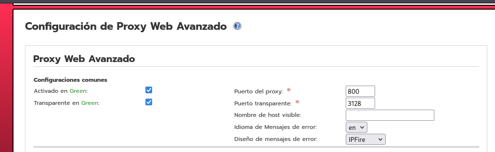


Activar:

* Habilitar proxy
* Modo transparente
* Puerto 800

Guardar cambios.

***

## Validación

```
Sistema → Estado
```

Debe aparecer:

```
Proxy encendido
```

***

# FASE 2 — Activación del filtro

## Objetivo

Habilitar el filtrado de contenido.

## Configuración

Ruta:

```
Servicios → Proxy web
```

Activar:

* Filtro de URL


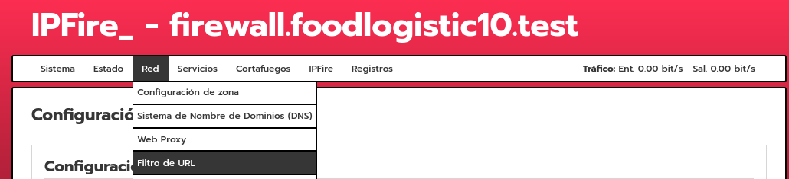


Guardar.

***

## Validación

* Proxy activo
* Sin errores en configuración

***

# FASE 3 — Bloqueo por dominio

## Objetivo

Bloquear páginas específicas.

## Configuración

Ruta:

```
Servicios → Filtro de URL
```

Sección: Lista negra personalizada

Añadir:

```
elnacional.cat
tecnocampus.cat
```

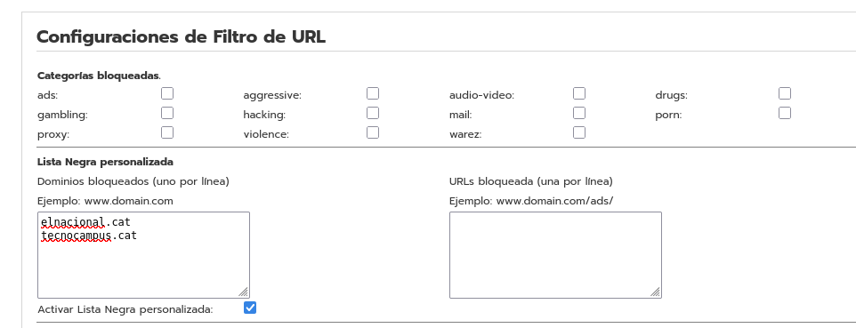


Activar lista negra.

Guardar cambios.

***

## Validación

Probar:

```
https://elnacional.cat
https://tecnocampus.cat
```

Resultado esperado:

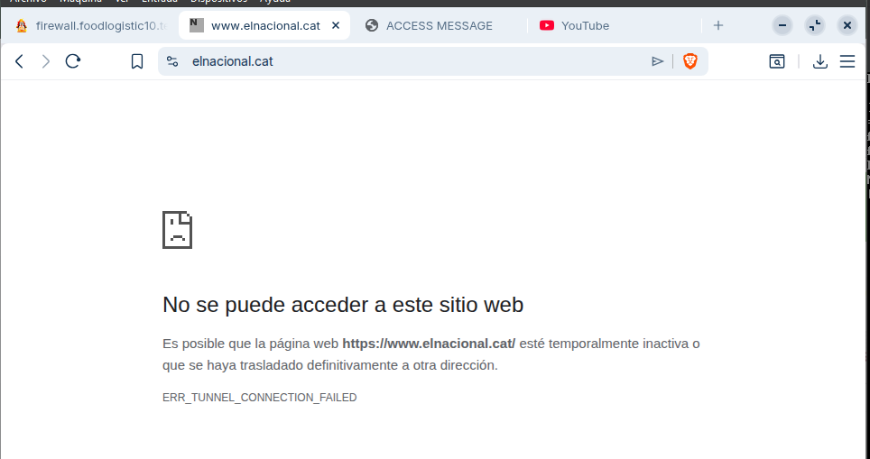

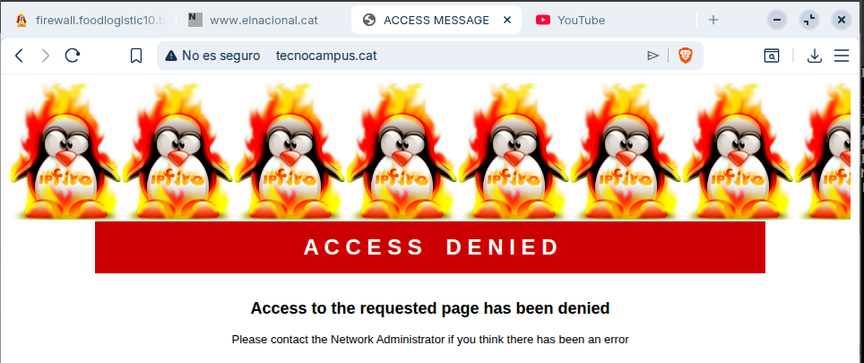


* Acceso bloqueado

***

# FASE 4 — Bloqueo por categorías

## Objetivo

Bloquear tipos de contenido.

## Configuración

Ruta:

```
Servicios → Filtro de URL
```

Buscar categorías y bloquear:

* banking / finance
* radio

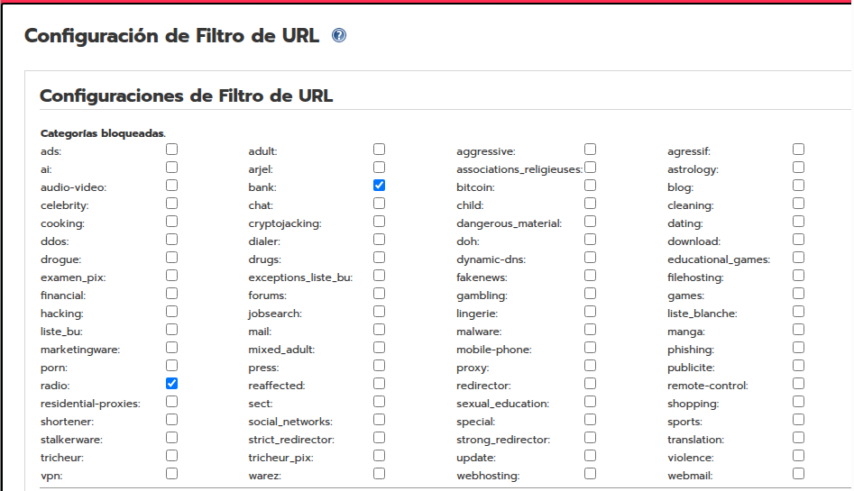


Guardar cambios.

***

## Validación

Probar:

```
https://www.ing.es
https://www.ah.fm
```

Resultado esperado:

* Sitios bloqueados

***

# FASE 5 — Bloqueo de URL específica

## Objetivo

Control granular dentro de un dominio.

## Configuración

Ruta:

```
Filtro de URL → URLs bloqueadas
```

Añadir:

```
example.com/test

```
o tambien intentaremos bloquear una URL especifica de YouTube como lo es un canal de YT.

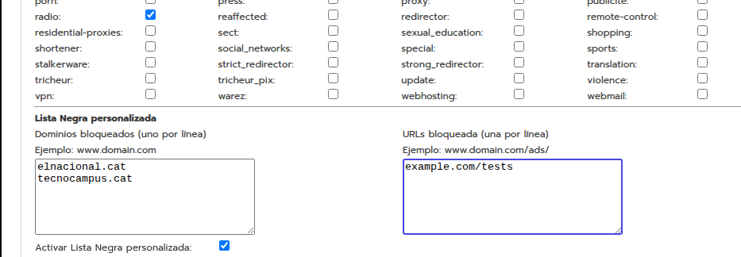


Guardar.

***

## Validación

Pruebas:

```
http://youtube.com/@Fernanfloo   → bloqueado
```

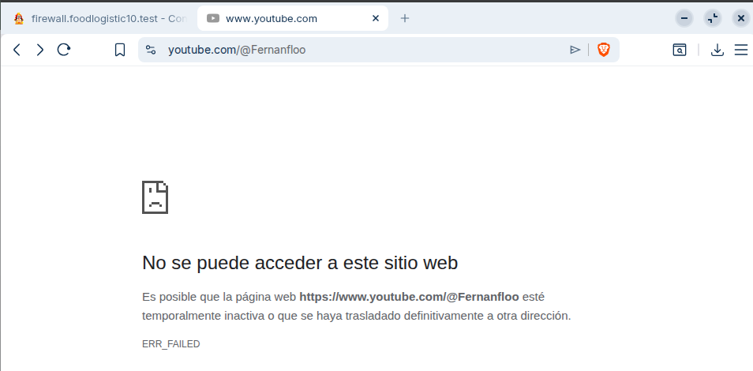

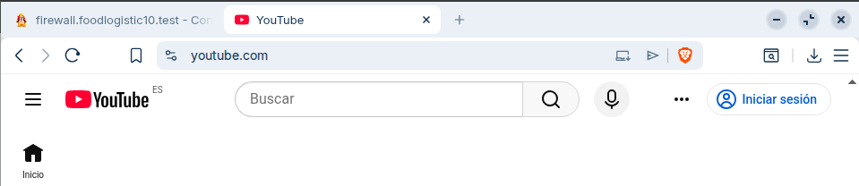

```
http://youtube.com        → permitido
```

***

# FASE 6 — Filtrado por palabra clave

## Objetivo

Bloquear contenido dinámico por coincidencia.

## Configuración

Ruta:

```
Filtro de URL → Expresiones / Keywords
```

Añadir:

```
anime
```

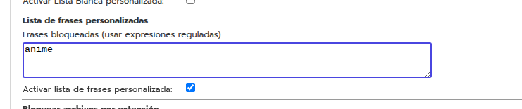

***

## Excepción

Ruta:

```
Filtro de URL → Lista blanca
```

Añadir:

```
animenewsnetwork.com
```

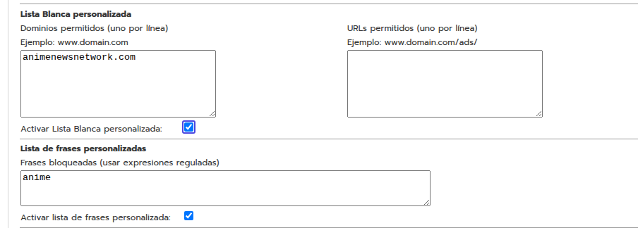

Guardar cambios.

***

## Validación

Pruebas:

```
animeflv.net              → bloqueado
```

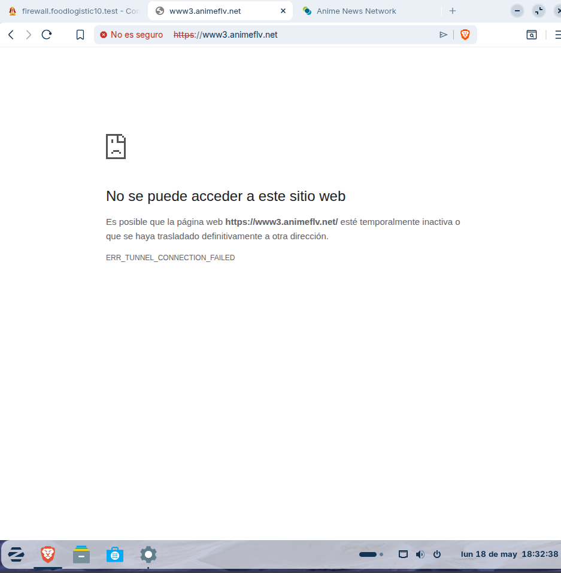


```
animenewsnetwork.com      → permitido
```

***

# FASE 7 — Restricción por horario

## Objetivo

Control de acceso temporal.

## Configuración

Ruta:

```
Filtro de URL → Control de acceso / Time rules
```

Crear regla:

* Hora inicio
* Hora fin
* Acción: bloquear categoría o dominio

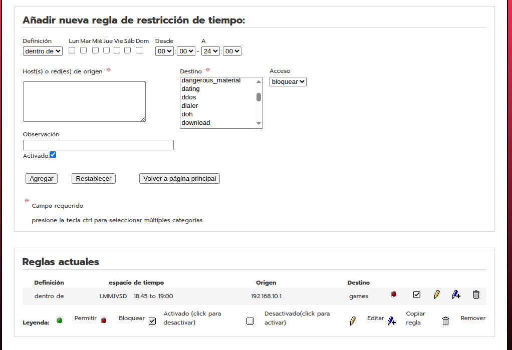

Guardar cambios.

***

## Validación

* Dentro del horario → acceso bloqueado

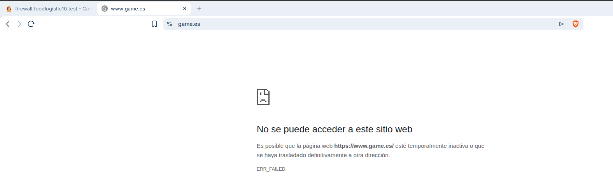

* Fuera del horario → acceso permitido

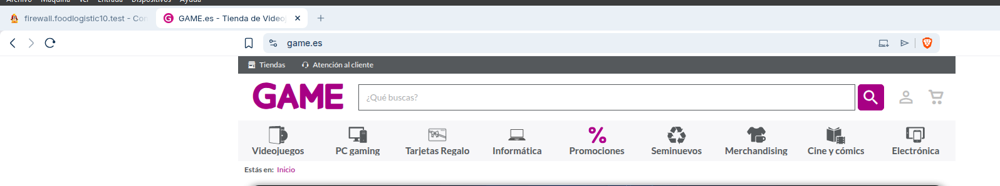

